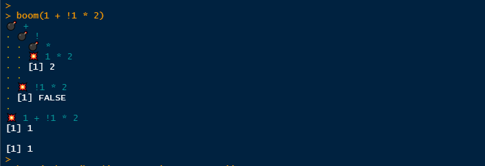
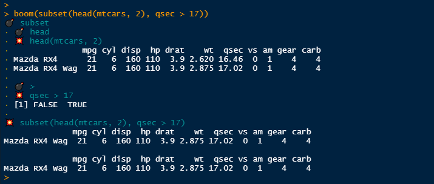
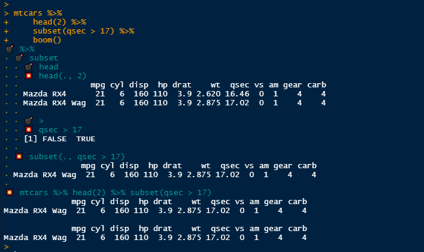
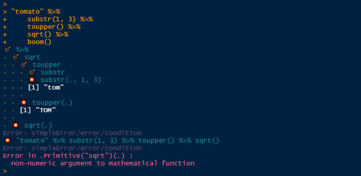
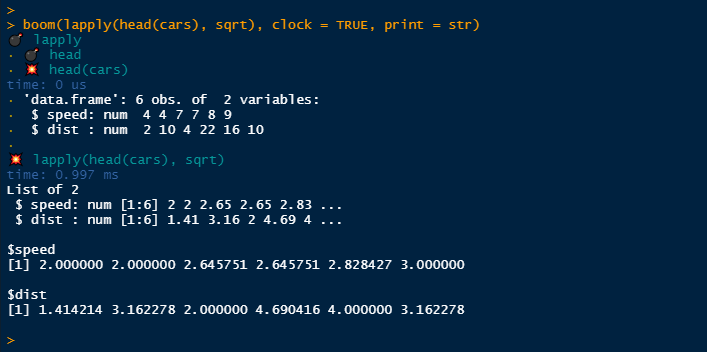
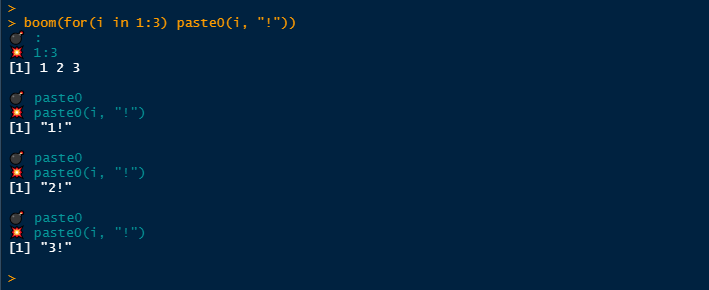
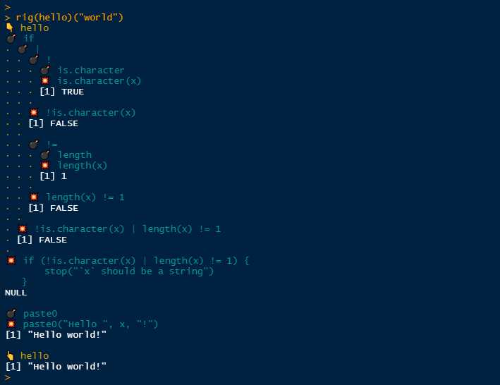
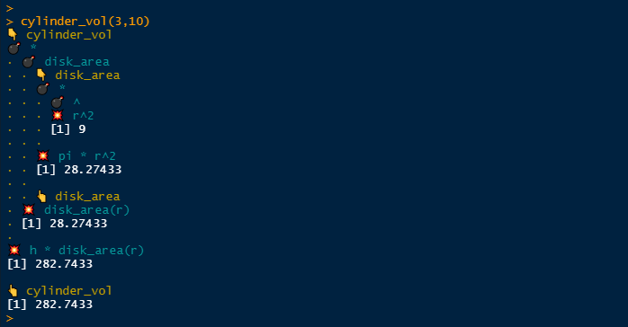
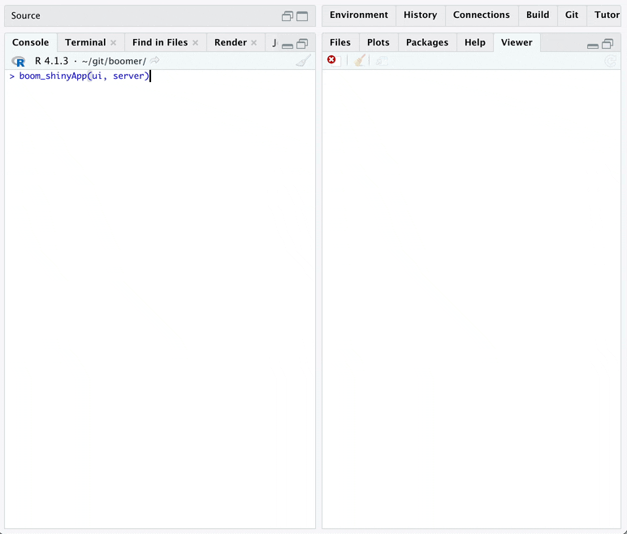

<!-- badges: start -->

[](https://github.com/moodymudskipper/boomer/actions)
<!-- badges: end -->

# boomer 

The *{boomer}* package provides debugging tools that let you inspect the
intermediate results of a call. The output looks as if we explode a call
into its parts hence the name.

- `boom()` prints the intermediate results of a call or a code chunk.
- `rig()` creates a copy of a function which will display the
  intermediate results of all the calls of it body.
- `rig_in_namespace()` rigs a namespaced function in place, so its
  always verbose even when called by other existing functions. It is
  especially handy for package development.

## Installation

Install CRAN version with:

``` r
install.packages("boomer")
```

Or development version with:

``` r
remotes::install_github("moodymudskipper/boomer")
```

## `boom()`

``` r
library(boomer)
boom(1 + !1 * 2)
```



``` r
boom(subset(head(mtcars, 2), qsec > 17))
```



You can use `boom()` with *{magrittr}* pipes or base R pipes: just pipe
to `boom()` at the end of a pipe chain.

``` r
library(magrittr)
mtcars %>%
  head(2) %>%
  subset(qsec > 17) %>%
  boom()
```



If a call fails, *{boomer}* will print intermediate outputs up to the
occurrence of the error, it can help with debugging:

``` r
"tomato" %>%
  substr(1, 3) %>%
  toupper() %>%
  sqrt() %>%
  boom()
```



`boom()` features optional arguments :

- `clock`: set to `TRUE` to see how long each step (in isolation!) took
  to run.

- `print`: set to a function such as `str` to change what is printed
  (see `?boom` to see how to print differently depending on class).
  Useful alternatives would be `dplyr::glimpse` of `invisible` (to print
  nothing).

One use case is when the output is too long.

``` r
boom(lapply(head(cars), sqrt), clock = TRUE, print = str)
```



`boom()` also works works on loops and multi-line expression.

``` r
 boom(for(i in 1:3) paste0(i, "!"))
```



## `rig()`

`rig()` a function in order to `boom()` its body, its arguments are
printed by default when they’re evaluated.

``` r
hello <- function(x) {
  if(!is.character(x) | length(x) != 1) {
    stop("`x` should be a string")
  }
  paste0("Hello ", x, "!")
}
rig(hello)("world")
```



## `rig_in_namespace()`

`rig()` creates a copy of a function, but when developing a package we
might want to rig a function in place so it has a verbose output when
called by other functions. For this we can use `rig_in_namespace()`.

For instance you might have these functions in a package :

``` r
cylinder_vol <- function(r, h) {
  h * disk_area(r)
}

disk_area <- function(r) {
  pi * r^2
}
```

`cylinder_vol` depends on `disk_area`, call `devtools::load_all()` then
`rig_in_namespace()` on both and enjoy the detailed output:

``` r
devtools::load_all()
rig_in_namespace(cylinder_vol, disk_area)
cylinder_vol(3,10)
```



## `boom_on()` and `boom_off()`

While debugging a function, call `boom_on()` and all subsequent calls
will be boomed, call `boom_off()` to return to standard debugging.


## `boom_shinyApp()`

A very experimental feature that allows you to rig the reactives of a
shiny app. See `vignette("shiny", "boomer")` for more information.

For the following app, saved in a proper project/package:

``` r
histogramUI <- function(id) {
  tagList(
    selectInput(NS(id, "var"), "Variable", choices = names(mtcars)),
    numericInput(NS(id, "bins"), "bins", value = 10, min = 1),
    plotOutput(NS(id, "hist"))
  )
}

histogramServer <- function(id) {
  moduleServer(id, function(input, output, session) {
    data <- reactive(mtcars[[input$var]])
    output$hist <- renderPlot({
      hist(data(), breaks = input$bins, main = input$var)
    }, res = 96)
  })
}

ui <- fluidPage(
  histogramUI("hist1")
)
server <- function(input, output, session) {
  histogramServer("hist1")
}
```

The output of `boom_shinyApp(ui, server)` will look like:



There will be issues, please report!

## Addin

To avoid typing `boom()` all the time you can use the provided addin
named *“Explode a call with `boom()`”*: just attribute a key combination
to it (I use ctrl+shift+alt+B on windows), select the call you’d like to
explode and fire away!

## Options

Several options are proposed to weak he printed output of {boomer}’s
functions and addin, see `?boomer` to learn about them.

In particular on some operating systems *{boomer}*’s functions’ output
might not always look good in markdown report or reprexes. It’s due to
how he system handles UTF-8 characters. In this case one can use
`options(boomer.safe_print = TRUE)` for a more satisfactory input.

## Notes

*{boomer}* prints the output of intermediate steps as they are executed,
and thus doesn’t say anything about what isn’t executed, it is in
contrast with functions like `lobstr::ast()` which return the parse
tree.

Thanks to @data_question for suggesting the name *{boomer}* on
[twitter](https://twitter.com/data_question/status/1356615026988179464).
