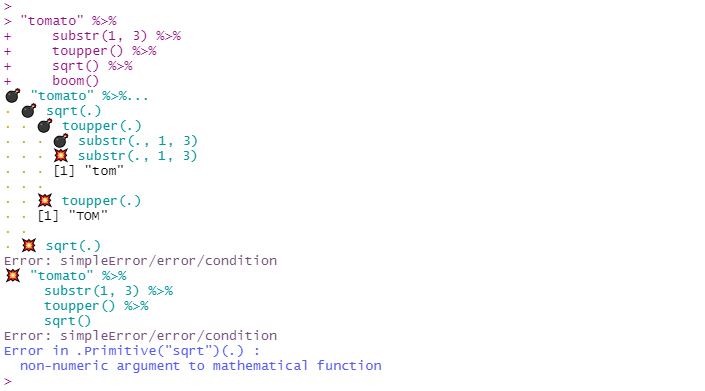
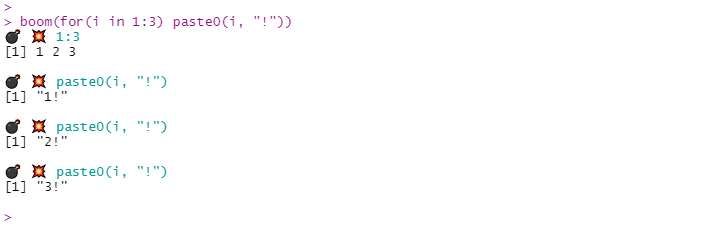
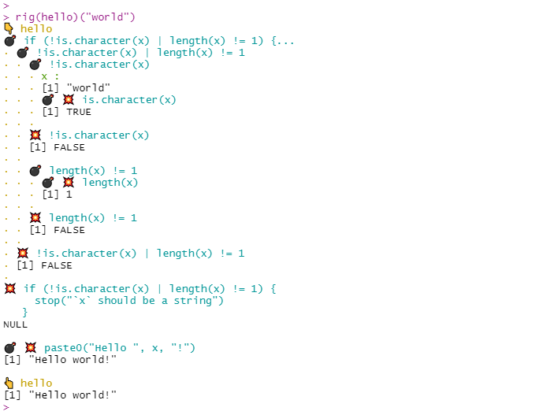
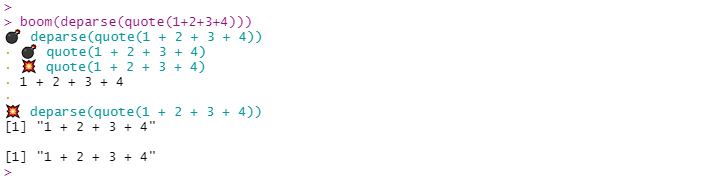

<!-- badges: start -->

[](https://github.com/moodymudskipper/boomer/actions)
<!-- badges: end -->

# boomer 

*{boomer}* is a debugging tool that lets you look at intermediate
results of a call. It “explodes” the call into its parts hence the name.

A function can be “rigged”, so it will print the result of all the
function calls of their body.

## Installation

Install with:

``` r
remotes::install_github("moodymudskipper/boomer")
```

## `boom()`

``` r
library(boomer)
boom(1 + !1 * 2)
```


``` r
boom(subset(head(mtcars, 2), qsec > 17))
```


You can use `boom()` with *{magrittr}* pipes, just pipe to `boom()` at
the end of a pipe chain.

``` r
library(magrittr)
mtcars %>%
  head(2) %>%
  subset(qsec > 17) %>%
  boom()
```


If a call fails, *{boomer}* will print intermediate outputs up to the
occurrence of the error, it can help with debugging:

``` r
"tomato" %>%
  substr(1, 3) %>%
  toupper() %>%
  sqrt() %>%
  boom()
```



`boom()` features optional arguments, the main ones are :

  - `clock`: set to `TRUE` to see how long each step (in isolation\!)
    took to run.

  - `print`: set to a function such as `str` to change what is printed
    (see `?boom` to see how to print differently depending on class).
    Useful alternatives would be `dplyr::glimpse` of `invisible` (to
    print nothing).

This is useful when the output is too long.

``` r
boom(lapply(head(cars), sqrt), clock = TRUE, print = str)
```


`boom()` also works works on loops and multi-line expression.

``` r
 boom(for(i in 1:3) paste0(i, "!"))
```



## `rig()`

`rig()` a function in order to `boom()` its body :

``` r
hello <- function(x) {
  if(!is.character(x) | length(x) != 1) {
    stop("`x` should be a string")
  }
  paste0("Hello ", x, "!")
}
rig(hello)("world")
```



## Addin

To avoid typing `boom()` all the time you can use the provided addin
named *“Explode a call with `boom()`”*: just attribute a key combination
to it (I use ctrl+shift+alt+B on windows), select the call you’d like to
explode and fire away\!

The default values of the optional arguments of `boom()` are given by
the options `"boomer.clock"`, `"boomer.print"` etc, so by modifying
those you will change the behavior of the addin.

## Notes

For windows users *{boom}* doesn’t look good in markdown report or
reprexes at the moment.

*{boomer}* prints the output of intermediate steps as they are executed,
and thus doesn’t say anything about what isn’t executed, it is in
contrast with functions like `lobstr::ast()` which return the parse
tree.

This will be noticeable with some uses of non standard evaluation.

``` r
lobstr::ast(deparse(quote(1+2+3+4)))
#> o-deparse 
#> \-o-quote 
#>   \-o-`+` 
#>     +-o-`+` 
#>     | +-o-`+` 
#>     | | +-1 
#>     | | \-2 
#>     | \-3 
#>     \-4
```

``` r
boom(deparse(quote(1+2+3+4)))
```



An earlier version of the package was released as *{boom}*, but a
package *{Boom}* already exists on CRAN so it was renamed. *{boom}*
won’t be maintained and will be archived, possibly removed.

Thanks to @data\_question for suggesting the name *{boomer}*.
