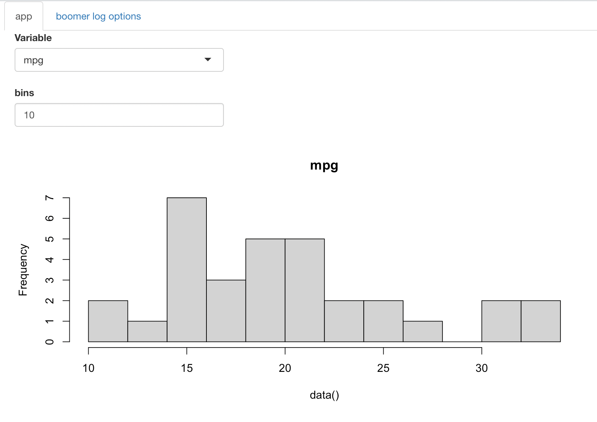
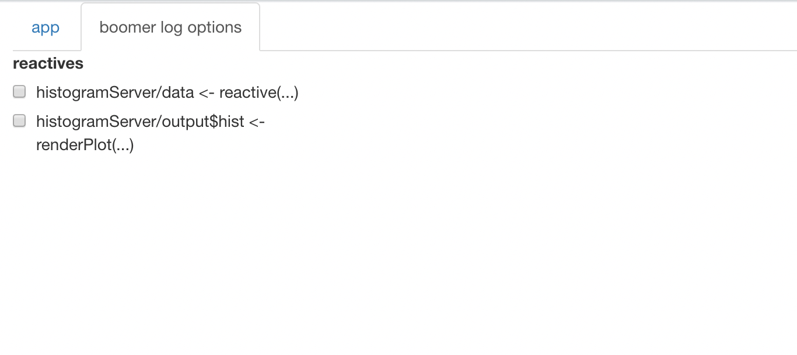

# Debug a shiny app with {boomer}

We propose a very experimental feature to debug shiny apps, it’s still
brittle but we decided to release anyway as it might be useful as is.

You’ll need the code of a shiny app saved in a proper project, and the
module structure of the shiny app should follow the recommendations of
Hadley Wickham’s book “Mastering Shiny”.

Under these assumptions following
[`boomer::boom_shinyApp()`](https://moodymudskipper.github.io/boomer/reference/boom_shinyApp.md)
is a drop in replacement for
[`shiny::shinyApp()`](https://rdrr.io/pkg/shiny/man/shinyApp.html),
running your app with enhanced debugging features.

For instance taking an example from “Mastering Shiny”, we can create a
file (it needs to be saved in the project!) and fill it with :

``` r
histogramUI <- function(id) {
  tagList(
    selectInput(NS(id, "var"), "Variable", choices = names(mtcars)),
    numericInput(NS(id, "bins"), "bins", value = 10, min = 1),
    plotOutput(NS(id, "hist"))
  )
}

histogramServer <- function(id) {
    moduleServer(id, function(input, output, session) {
      data <- reactive(mtcars[[input$var]])
      output$hist <- renderPlot({
        hist(data(), breaks = input$bins, main = input$var)
      }, res = 96)
    })
}

ui <- fluidPage(
  histogramUI("hist1")
)
server <- function(input, output, session) {
  histogramServer("hist1")
}
```

Then after making sure everything is loaded (you might call
`devtools::load_all()` in a package project), we can call
`boom_shinyApp(ui, server)` and we get the following app :



We see the same app as we would with
[`shiny::shinyApp()`](https://rdrr.io/pkg/shiny/man/shinyApp.html)
except it’s nested into an “app” tab and we have an additional “boomer
log options tab”, lets take a look:



In this additional tab we can tick which reactives we want to make
verbose.

In our example we defined two reactives in `histogramServer()` : `data`
and `output$hist`, if we tick
`histogramServer/output$hist <- renderPlot(...)` and select anything
that triggers an actualization of the reactive (i.e. that changes the
plot) we will observe verbose output in the console.

For instance if we set the number of bins to 15 we will see:


We hope that this can save developers from the chore of running and
stopping apps repeatedly with different variations of debugging code
cluttered in various places.
